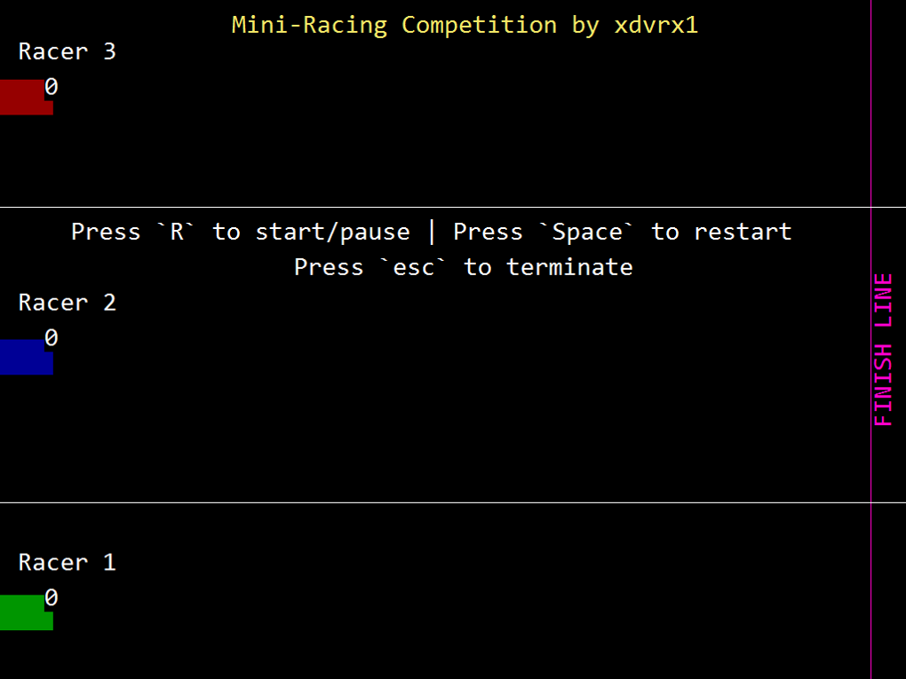

# Mini-Racing 2D Game

I'm happy to share with you my simple 2D game purely written in
PureBasic.

When you create games, whether 2D or 3D, there is no such thing
as *real movement*. Rather, when you flip the frames and you
had changed the position of an object relative to its original position,
you create the illusion of movement! That's all there is in creating
computer games! Of course, complex movements will require math computation.

Remember the screen resolution: 1024x768. This is the most common one.
When there is an error, don't worry, it will be handled by the 
`HandleError` in the source code. 

## The Good Old Days
PureBasic was my first ever programming language, so it reminds me of the good old days. 
Before PureBasic, I first learned Excel formulas, which really captured my interest. 
The very first time I encountered Excel was in college,
and it was the IF function presented by the professor that really caught my attention.

## Disclaimer
Please note that this project is presented as a showcase of my work during a 
specific period. It represents a snapshot of my skills and accomplishments 
at that time. As such, this project is no longer actively maintained or updated. 
It is kept public for demonstration purposes and may not reflect my current 
abilities or the latest best practices in the field.

Feel free to explore the project and its code. However, be aware that it might 
use outdated libraries or patterns and is not intended for production use in its current state.

## Compiling
To compile/run, just click `Compile/Run` in the PureBasic IDE. 
To create executable file, go to `Compiler` tab and click
`Create Executable`. You will be asked to name your executable
file. 

## License
MIT- the permissive license

## More PureBasic Projects
check the Main Page -> [PureBasic](https://github.com/jdevfullstack/PureBasic)
